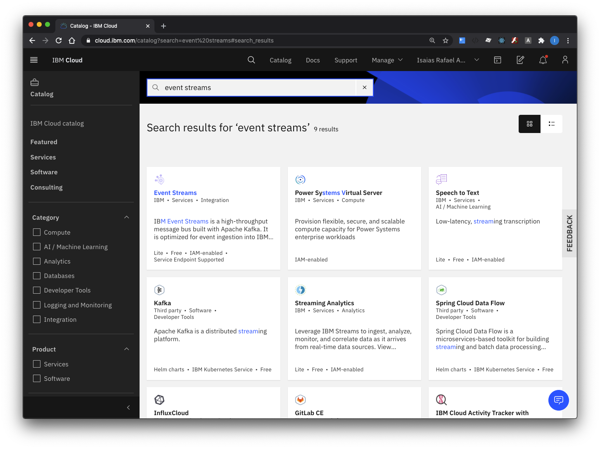
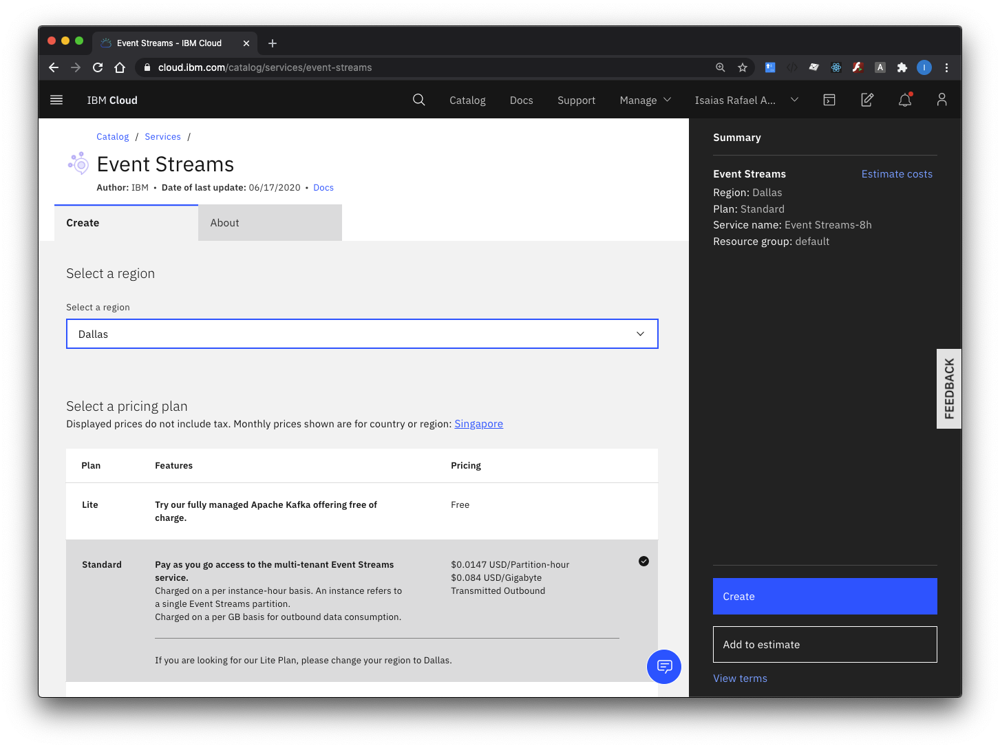
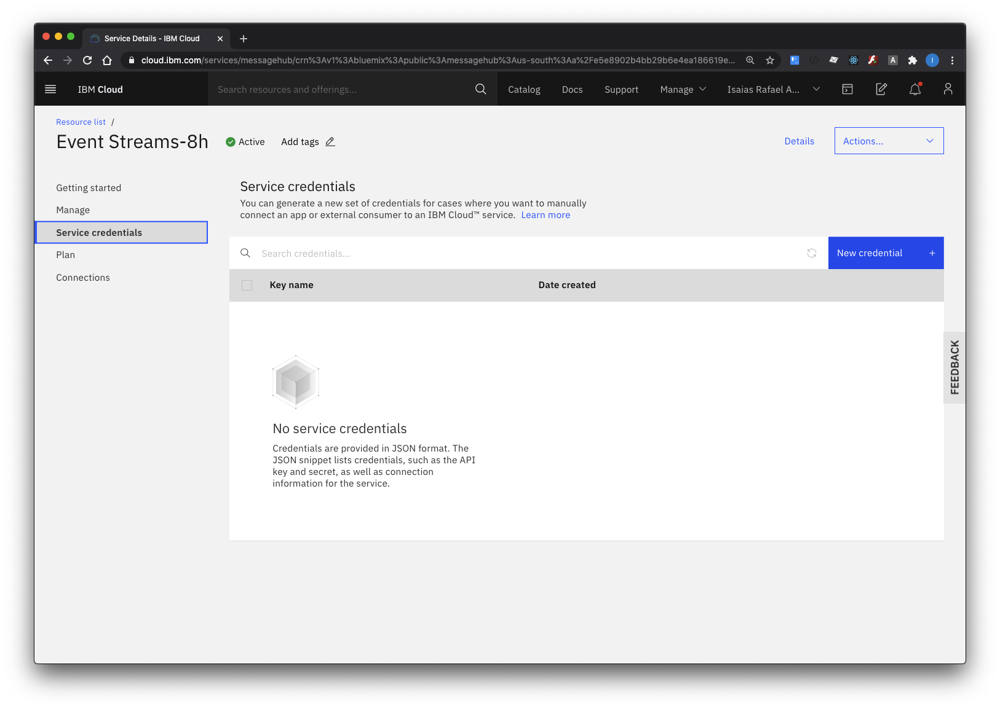
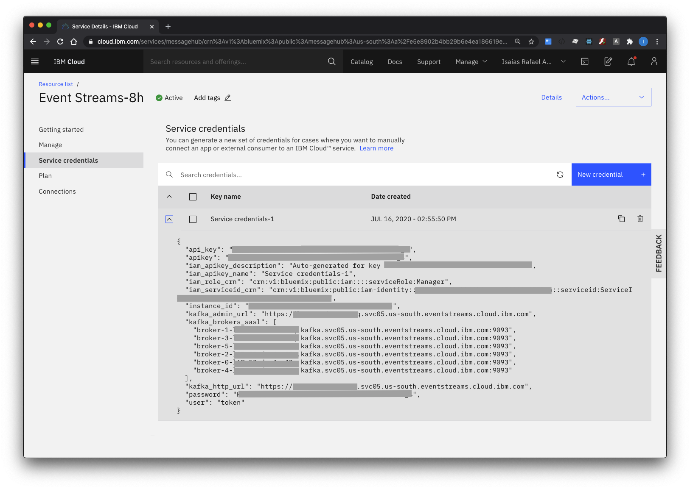

# Create IBM Event Streams Service

1. Login to IBM Cloud and go to Catalog. Browse or search for **event streams**

    

2. Select **Event Streams Service**, **Select a region** or use default.  Select **Lite** pricing plan.  Enter unique **service name** or use default. Then click on the **Create** button.

    

3. After creating the service, select **Service Credentials**

    

4. Create **New Credentials**, enter preferred name or use default. 

    

